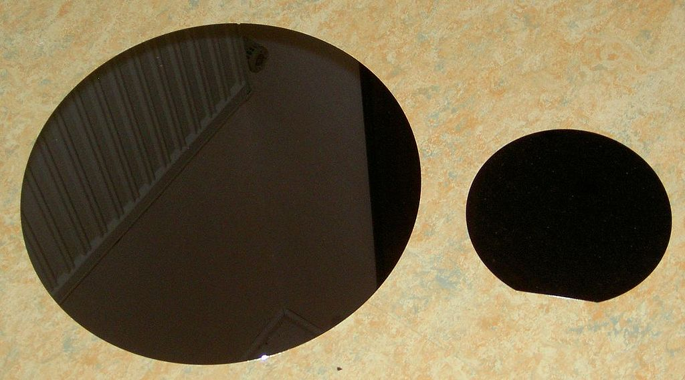

# wafer_detection
Wafer (In electronics), also called a slice or substrate, is a thin slice of semiconductor,
such as a crystalline silicon (c-Si), used for fabricationof integrated circuits and in photovoltaics,
to manufacture solar cells.
<
    
