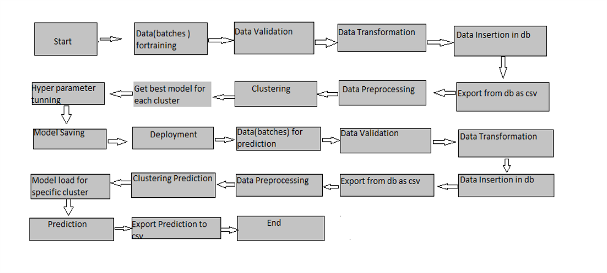

# Wafer Fault Detection
<h2>Introduction</h2>
Wafer (In electronics), also called a slice or substrate, is a thin slice of semiconductor,
such as a crystalline silicon (c-Si), used for fabricationof integrated circuits and in photovoltaics,
to manufacture solar cells.

The inputs of various sensors for different wafers have been provided.
The goal is to build a machine learning model which predicts whether a wafer needs to be replaced or not
(i.e whether it is working or not) nased on the inputs from various sensors.

There are two classes: +1 and -1.
   
           +1: Means that the wafer is in a working condition and it doesn't need to be replaced.
           -1: Means that the wafer is faulty and it needa to be replaced.

Done as an Internship under Ineuron Intelligence
https://ineuron.ai/

<h2>Architecture</h2>

<h2>Data Validation and Data Transformation </h2>

i) Name Validation - Validation of files name as per the DSA. We have created a regex pattern for validation. After it checks for date format and time format if these    
   requirements are satisfied, we move such files to <b>"Good_Data_Folder"</b> else <b>"Bad_Data_Folder"</b>.

ii) Number of Columns – Validation of number of columns present in the files, and if it doesn't match then the file is moved to "Bad_Data_Folder.“

iii) Name of Columns - The name of the columns is validated and should be the same as given in the schema file. If not, then the file is moved to "Bad_Data_Folder".

iv) Data type of columns - The data type of columns is given in the schema file. It is validated when we insert the files into Database. If the datatype is wrong, then the file     is moved to "Bad_Data_Folder".

v) Null values in columns - If any of the columns in a file have all the values as NULL or missing, we discard such a file and move it to "Bad_Data_Folder".

<h2>Data Insertion in Database</h2>

i) Table creation :- Table name  “Good_Data" is created in the database for inserting the files. If the table is already present then new files are inserted in the same table.

ii) Insertion of files in the table - All the files in the "Good_Data_Folder" are inserted in the above-created table. If any file has invalid data type in any of the columns, the file is not loaded in the table 

<h2>Model Training</h2>

<h4>Data Export from Db</h4>
     The accumulated data from db is exported in csv format for model training
<h4>Data Preprocessing</h4>  
     Performing EDA to get insight of data like  identifying distribution , outliers ,trend
     among data etc.

        a) Check for null values in the columns. If present, impute the null values using the KNN imputer.
        b) Check if any column has zero standard deviation, remove such columns as they don't give any information during model training.

<h4>Clustering</h4>  KMeans algorithm is used to create clusters in the preprocessed data. The optimum number of clusters is selected by plotting the elbow plot, and for the dynamic selection of the number of clusters, we are using "KneeLocator" function. The idea behind clustering is to implement different algorithms
The Kmeans model is trained over preprocessed data, and the model is saved for further use in prediction.
<h4>Model Selection</h4>  After the clusters have been created, we find the best model for each cluster. We are using two algorithms, <b>"Random Forest"</b> and <b>"XGBoost"</b>. For each cluster, both the algorithms are passed with the best parameters derived from GridSearch. We calculate the AUC scores for both models and select the model with the best score. Similarly, the model is selected for each cluster. All the models for every cluster are saved for use in prediction.

<h2>Prediction</h2>
 <ol>
   <li> The testing files are shared in the batches and we perform the same Validation operations ,data transformation and data insertion on them.</li>
   <li> The accumulated data from db is exported in csv format for  prediction.</li>
   <li>  We perform data pre-processing techniques on it.</li>
   <li> KMeans model created during training is loaded and clusters for the preprocessed data is predicted.</li>
   <li> Based on the cluster number respective model is loaded and is used to predict the data for that cluster.</li>
   <li> Once the prediction is done for all the clusters. The predictions  are saved in csv format and shared.</li>
</ol>
